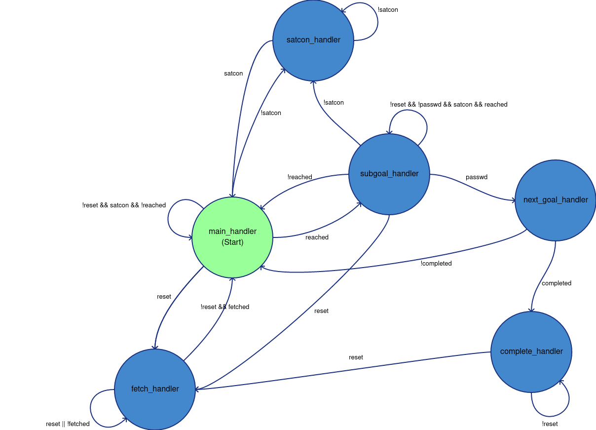
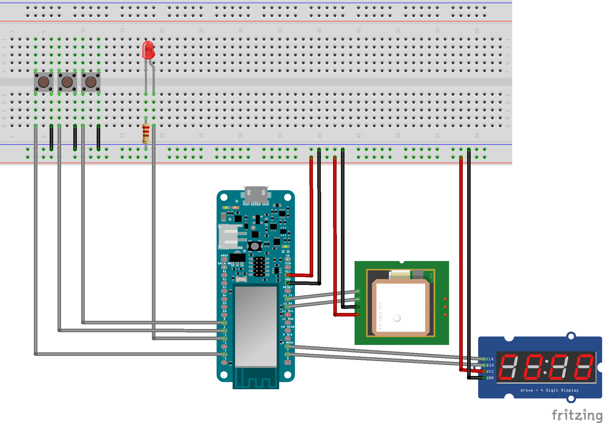

## Geocaching puzzle using the Arduino MKR1000

In this puzzle you need to find passwords that are hidden in certain locations. When you reach a specified location, you can enter the corresponding password and the next location is unlocked.
The challenge is to figure out, how to find the locations and the passwords.

To interact with this puzzle, there are 3 buttons:
*	**Reset** to reset the puzzle (it recommended to disconnect this button when playing)
*	**Pos** to set the cursor position (if the puzzle is in input mode)
*	**Count** is counting at the current cursor position (if the puzzle is in input mode)

The puzzle gives feedback via a 4-digit 7-segment display and a LED:
*	**4-digit 7-segment display**
	*	if its not possible to obtain a gps signal or there are no goals configured, this display shows 4 dashes
	*	When the current goal's location **isn't** reached, the display shows the distance to it
	*	When the current goal's location **is** reached a single dash is shown at cursor position
*	**LED** lights up when sattelite connection is lost

### How it works

The shown state machine consists of the following states:
*	**main_handler** is the initial state after setup is done and is the quasi idle state (only changing when something happens)
*	**fetch_handler** collects new goals from some source (not implemented yet) in case the reset button was pressed.
*	**satcon_handler** gives feedback via LED and tries to reconnect in case the sattelite connection was lost.
*	**subgoal_handler** checks the entered password when the location of current goal is reached and no errors occured.
*	**next_goal_handler** checks whether the completed subgoal was the final one and if so takes actions accordingly.
*	**complete_handler** idles until the reset button was pressed when the last goal is completed.

The shown state machine is dependent on the following conditions:
*	**reset** The reset button was pressed
*	**satcon** Satellite is not timed out
*	**reached** Location of the current goal is reached
*	**fetched** New goals have been fetched (not implemented yet)
*	**passwd** The current goals' password was entered correctly
*	**completed** The final goal was completed (YOU WON!)

### Setup

#### Dependencies

*	[TinyGPS++](http://arduiniana.org/libraries/tinygpsplus/)
*	[TM1637Display](https://github.com/avishorp/TM1637/blob/master/TM1637Display.h)

#### Hardware setup

*	**GPS** (*XCSOURCE GPS NEO-6M Module*)
*	**7-segment array** (*4 Bits Digital Tube LED Display Module*)
*	**LED** (*standard red led*)
*	**resistor** (*220 &Omega;*)
*	**buttons** (*Momentary switch*)

### Todos

*	**standby mode** (*disable wifi, gps and wait for hardware interrupt*)
*	**HIL** (*having tests as todo... how original!*)
*	**fetch_handler** has currently no purpose and the whole idea of fetching goals isn't implemented yet
*	**complete hardware setup** by adding an akku to the circuid
*	**hadware pullup resistors** for the buttons instead of software pullup
*	**feedback when the game is won** (*currently 4 dashes are displayed*)
